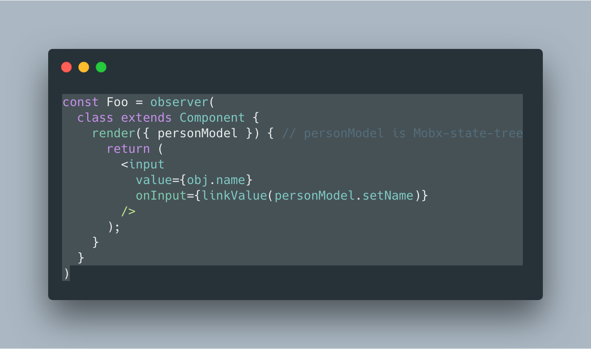

# linkFunction

> Create an Event handler function that call a given function with input value.

-   **Tiny:** ~**230 bytes** of [ES3](https://unpkg.com/linkfunction) gzipped
-   **Familiar:** it's just a function that does what you would have done manually
-   **Standalone:** one function, no dependencies, works everywhere

* * *

## Table of Contents

-   [Installation](#installation)
-   [How It Works](#how-it-works)
-   [Usage](#usage)
-   [Why](#why)
-   [Contribute](#contribute)
-   [Credits](#credits)
-   [License](#license)

* * *

## Installation

```sh
npm install --save linkfunction
```

The [UMD](https://github.com/umdjs/umd) build is also available on [unpkg](https://unpkg.com/linkfunction/dist/linkfunction.umd.js):

```html
<script src="//unpkg.com/linkfunction/dist/linkfunction.umd.js"></script>
```

This exposes the `linkFunction()` function as a global.

* * *

## How It Works

It's important to understand what linkFunction does in order to use it comfortably.

**`linkFunction(fn, [valuePath])`**

- `fn`: the function that will called with value as parameter
- `valuePath`: _optional_ key/path into the event object at which to retrieve the new value


Here's two equivalent event handlers, one created manually and one created with linkFunction:

```js
handleInput = e => {
  myFn(e.target.value)
}

handleInput = linkFunction(myFn)
```

Notice how we didn't specify the event path - if omitted, `linkFunction()` will use the `checked` or `value` property of the event target, based on its type.

## Usage

Standard usage is a function that returns an event handler that call your given function witn input value.

```js
import linkFunction from '@ridermansb/linkfunction';

class Foo extends Component {
  setName(name) {
    const { obj } = this.props;
    obj.setName(name);
  }
  render({ obj }) {
    return (
      <input
        value={obj.name}
        onInput={linkFunction(this.setName)}
      />
    );
  }
}
```

## Why

The main reason is for supporting updates with [mobx-state-tree][mst] models.   
This lib will made easy update models with inputs



That example, will update any related component once input has changed.

* * *

## Contribute

First off, thanks for taking the time to contribute!
Now, take a moment to be sure your contributions make sense to everyone else.

### Reporting Issues

Found a problem? Want a new feature? First of all see if your issue or idea has [already been reported](../../issues).
If it hasn't, just open a [new clear and descriptive issue](../../issues/new).

### Submitting pull requests

Pull requests are the greatest contributions, so be sure they are focused in scope, and do avoid unrelated commits.

> 💁 **Remember: size is the #1 priority.**
>
> Every byte counts! PR's can't be merged if they increase the output size much.

-   Fork it!
-   Clone your fork: `git clone https://github.com/<your-username>/linkfunction`
-   Navigate to the newly cloned directory: `cd linkfunction`
-   Create a new branch for the new feature: `git checkout -b my-new-feature`
-   Install the tools necessary for development: `npm install`
-   Make your changes.
-   `npm run build` to verify your change doesn't increase output size.
-   `npm test` to make sure your change doesn't break anything.
-   Commit your changes: `git commit -am 'Add some feature'`
-   Push to the branch: `git push origin my-new-feature`
-   Submit a pull request with full remarks documenting your changes.

## Credits

This project was created based on [linkstate][linkstate].

The main reason to created another one was the dependencies. linkFunction has no dependency of framework or lib, just function that call another function.

However, I would like to thanks [Jason Miller](https://jasonformat.com/) for the incredible project 

## License

[MIT License](LICENSE.md) © [Riderman de Sousa Barbosa](http://ridermansb.github.io/)

[linkstate]: https://github.com/developit/linkstate
[mst]: https://github.com/mobxjs/mobx-state-tree#identifiers
